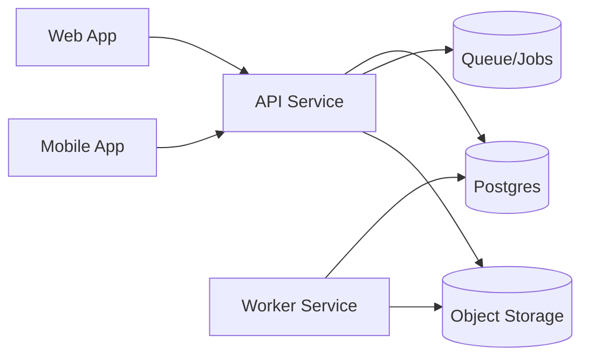

# ChronoLedger

ChronoLedger is an auditable timekeeping system with pay-period reporting and official exports. This repository contains the complete project, including application code, infrastructure, and documentation.

## What this is

ChronoLedger is built to help individuals or teams:

- Track time entries with strong correctness rules (e.g., no overlaps, clear “open entry” behavior)
- Summarize time by pay period (PP1: 1–15, PP2: 16–end of month)
- Support admin workflows (e.g., lock/unlock, audit trail, approvals)
- Generate “official” export outputs (PDF first; other formats later)

## Guiding principles

- **Correctness over convenience**: enforce constraints at the DB + API level, not just the UI.
- **Auditability by default**: actions that matter produce traceable records.
- **Docs + ADR-driven decisions**: architecture choices are recorded before implementation.
- **Testable exports**: PDF outputs should be deterministic (golden fixtures + versioned templates).

## Repository layout

This repo starts **docs-first** (so we don’t write features before the foundation is agreed), then expands into apps/services.

```
docs/
  00-roadmap/        # project roadmap + session summaries
  01-requirements/   # requirements + traceability mapping
  02-adr/            # architecture decision records (ADRs)
  03-api/            # API surface outlines / OpenAPI
  04-data/           # schema blueprint, constraints, fixtures
  05-ux/             # UX flows + wireframes
  06-reports/        # report/export catalog
  07-infra/          # local dev plan, IaC plans, CI/CD plans
  08-testing/        # test strategy and harness decisions

apps/                # added when feature coding begins (web/mobile/api/worker)
packages/            # shared types/config/libs (added later)
infra/               # IaC (added later)
```

## Key docs to read first

- Roadmap: `docs/00-roadmap/`
- Requirements: `docs/01-requirements/chronoledger-requirements.md`
- ADRs (what we’ve decided and why): `docs/02-adr/`
- Pre-coding checklist / readiness: see the latest roadmap notes in `docs/00-roadmap/`

## Architecture at a glance (target shape)

ChronoLedger is expected to be a small set of clients + services around a single source-of-truth database:



Exact technology selections live in `docs/02-adr/` and may evolve as ADRs are accepted.

## Project status

This repo is currently in **foundation mode**:

- Consolidating requirements
- Finalizing ADRs
- Defining schema + API surface
- Designing exports and test strategy

Feature coding begins after the “pre-coding readiness” items in the roadmap are satisfied.

## Contributing

- Use ADRs for meaningful architecture decisions (see `docs/02-adr/ADR-TEMPLATE.md`).
- Keep changes small, reviewable, and well-documented.
- Prefer adding fixtures/tests alongside any logic that affects correctness or exports.

## License

This project is licensed under the MIT License - see the [LICENSE.md](LICENSE.md) file for details.

