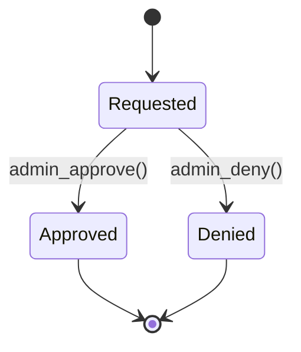

# ADR-0028: Domain Invariants and State Machines (Time Entries, Unlocks, ATO)

- Status: Accepted
- Date: 2026-01-02

## Context

ChronoLedger is a time-clock style system that stores **raw times** (UTC) and derives calculations (rounding, weekly
totals, pay) at runtime. The system must:

- prevent overlapping entries
- enforce lock/unlock workflow with admin approval
- support ATO rules (Mon–Fri only; 8h/day cap; 40h per 5-day work week)
- auto-split cross-midnight entries and retain original capture timezone
- maintain auditability (append-only audit tables per domain)

## Decision

Define explicit **domain invariants** and **state machines**. The API is authoritative; clients may pre-validate for
UX only.

### 1) Core domain invariants

**Time storage**

- All instants stored in DB are **UTC** (`*_utc` columns).
- Each entry stores `capture_time_zone` (IANA tz) reflecting the client/device timezone at capture time.
- Display time zone is a **calculation** (default device tz; optional user/device override).

**Overlaps**

- A user may not have overlapping time entries within a tenant (excluding soft-deleted records).
- Overlap checks apply across categories (work/contract/additional/ATO, etc.).
- Only one open (no `end_utc`) time entry is allowed per user per tenant.

**Locking**

- A time entry becomes immutable when `is_locked=true`.
- Locked entries cannot be edited or deleted (soft delete) unless they are unlocked via an approved unlock request.

**Cross-midnight**

- When closing an entry that spans a local-date boundary (in the relevant display tz at the time of capture),
  the system auto-splits into multiple entries, one per day segment, preserving raw UTC times and the capture timezone.

**ATO constraints**

- ATO entries are allowed **Mon–Fri only** (based on the selected display tz for the user/device at entry time).
- ATO is capped at **8 hours per day**.
- ATO weekly cap: **≤ 40 hours per 5-day work week** (Mon–Fri). Weekend ATO is disallowed.
- Holidays are treated as normal days, but flagged for visibility.

**Pay rates**

- Pay rates are effective-dated, and changes only take effect on the **1st of a month**.

### 2) State machines

#### 2.1 Time Entry lifecycle

- Draft/Open: `end_utc IS NULL`, `is_locked=false`
- Completed/Unlocked: `end_utc NOT NULL`, `is_locked=false`
- Completed/Locked: `end_utc NOT NULL`, `is_locked=true`
- Deleted: `deleted_at NOT NULL`

```mermaid
stateDiagram-v2
  [*] --> Open
  Open --> CompletedUnlocked: close(end_utc set)
+ overlap check
+ cross-midnight split
  CompletedUnlocked --> Locked: lock()
  Locked --> UnlockRequested: request_unlock()
  UnlockRequested --> Unlocked: admin_approves_unlock()
sets is_locked=false
  UnlockRequested --> Locked: admin_denies_unlock()
  Unlocked --> Locked: lock()
  CompletedUnlocked --> Deleted: soft_delete()
  Unlocked --> Deleted: soft_delete()
  Locked --> Deleted: (not allowed)
requires unlock
```

#### 2.2 Unlock Request lifecycle

Unlock requests are immutable records tied to a time entry.



### 3) Enforcement location

- All invariants are enforced in the API (and DB constraints where appropriate).
- Worker jobs (PDF exports, etc.) do not mutate time-entry state.

## Consequences

- ✅ Clear, testable rules and predictable behavior across clients
- ✅ Prevents data integrity issues (overlaps, unauthorized edits)
- ✅ Simplifies later configurability (tenant-specific rules can be layered)
- ⚠️ Cross-midnight splitting can surprise users; UI must show the split clearly and preserve originals in audit
- ⚠️ Some invariants are timezone-sensitive; we must standardize which tz is used for day/week boundaries

## Notes/Links

- Overlap protection is reinforced in ADR-0031 (DB constraints + transaction rules).
