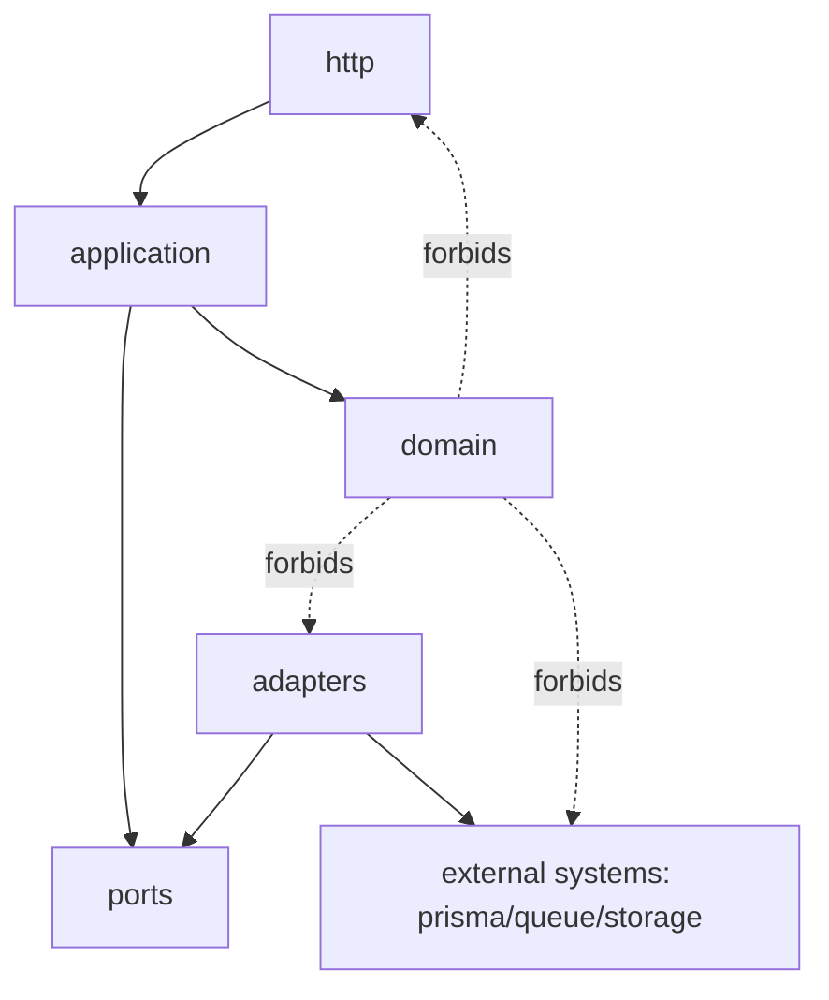

# ADR-0034 — API Internal Architecture: Vertical Slice + Hexagonal Boundaries

## Status

Accepted (2026-01-04)

## Context

ChronoLedger’s API will evolve beyond simple CRUD due to:

- auditability requirements (append-only history, traceability)
- export generation (PDF-first, async jobs/worker)
- business rules for time entry validation, pay periods, locking/unlocking, and ATO ledger
- potential mobile sync constraints (retries, idempotency, conflicts)

A simple layered structure (controllers/services/repos) tends to blur business rules across layers as complexity grows.
We want an architecture that:

- supports incremental delivery (vertical slices)
- enforces isolation of domain rules from frameworks (Nest), persistence (Prisma), and transports (HTTP)
- makes unit testing domain and use cases straightforward

## Decision

We will implement the API using a **hybrid architecture**:

1) **Vertical Slice (feature-first) at the top level**

- Organize code by **feature modules** (e.g., `time-entry`, `reports`, `auth`, `ato`, `locks`).

1) **Hexagonal/Clean boundaries inside each feature**
Each feature module will follow this internal structure:

- `domain/` — pure domain rules and value objects (no Nest/Prisma/HTTP imports)
- `application/` — use cases / services that orchestrate domain + ports
- `adapters/` — implementations of ports (Prisma repositories, queue publishers, storage clients)
- `http/` — controllers, DTOs, validation, request/response mapping

### Boundary rules (hard constraints)

- `domain/` MUST NOT import from NestJS, Prisma, DB clients, HTTP libraries, queue clients, or framework decorators.
- `application/` MAY reference `domain/` and port interfaces; MUST NOT reference `http/` and SHOULD NOT reference
  concrete `adapters/`.
- `adapters/` implement ports and MAY reference Prisma/queue/storage.
- `http/` maps transport to use cases; MUST NOT contain business rules.

## Consequences

### Positive

- Domain logic is stable, testable, and not coupled to NestJS/Prisma.
- Feature-first structure supports incremental “vertical slice” delivery.
- Use cases become explicit and auditable (easy to reason about “what the system does”).
- Cleaner seams for future changes (renderer swaps, DB evolution, queue implementation changes).

### Negative / Tradeoffs

- Slightly more files and structure up front.
- Requires discipline in code review to prevent boundary leakage.

## Alternatives considered

- **Layered architecture (controllers/services/repos)**: simpler initially, but tends to leak rules and become harder
  to test.
- **Pure Clean Architecture across the whole repo (layer-first)**: very strict, but makes navigation harder for
  feature-driven delivery.

## Implementation sketch

### Suggested directory shape (API)

```text
apps/api/src/
  modules/
    time-entry/
      domain/
        TimeInterval.ts
        PayPeriod.ts
        TimeEntry.ts
        timeEntryRules.ts
      application/
        ports/
          TimeEntryRepository.ts
        usecases/
          CreateTimeEntry.ts
          UpdateTimeEntry.ts
      adapters/
        prisma/
          PrismaTimeEntryRepository.ts
      http/
        TimeEntryController.ts
        dtos/
          CreateTimeEntryDto.ts
    reports/
      ...
  shared/
    domain/
    application/
    adapters/
```

### Dependency direction



## Enforcement

- Code review checklist item: “Is this business rule in `domain/` or `application/`?”
- Prefer unit tests at `domain/` and `application/` layers.
- Optional later: add boundary lint rules (ESLint import restrictions) to prevent illegal imports.

## Repo placement

Save this file at:

- `docs/02-adr/ADR-0034-api-internal-architecture-vertical-slice-hexagonal.md`

Then update any applicable index files (e.g., `docs/README.md`, `docs/02-adr/README.md`) to include a link.
