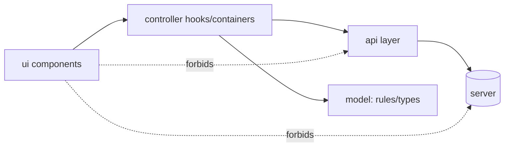

# ADR-0035 — Frontend Architecture: Feature Modules + MVC-ish Layers + Dumb Views

## Status
Accepted (2026-01-04)

## Context
ChronoLedger’s frontends (Web + Mobile) must support complex user flows:
- time entry creation/editing
- running timers / open intervals
- pay period summaries and validation feedback
- report/export requests and status

React (web and React Native) does not align with classic “controller classes,” but it benefits from clear separation:
- view rendering vs orchestration vs business rules vs network plumbing

We explicitly want to keep **as much logic out of view components as possible** to improve testability, reuse, and maintainability.

## Decision
We will implement the frontend using:

1) **Feature-first organization**
- Group code by product feature (e.g., `time-entry`, `reports`, `settings`, `auth`).

2) **MVC-inspired layering inside each feature**
- `ui/` = **View** (presentational components; minimal logic)
- `controller/` = **Controller** (hooks/containers that orchestrate state, queries, mutations, navigation)
- `model/` = **Model** (types, pure rules, value objects; no React imports)
- `api/` = network/data access (HTTP calls, query keys, serialization; no business rules)

### “Dumb view” rule
View components in `ui/`:
- SHOULD be stateless when practical
- MAY contain small UI-only logic (local toggles, focus handling, formatting for display)
- MUST NOT fetch/mutate data directly
- MUST NOT implement business rules (pay period calculations, validation rules, ATO math)

## Consequences
### Positive
- Views remain simple and reusable.
- Business rules stay testable as pure functions.
- Controllers become the single place for orchestration and side effects.
- Clear boundaries reduce “logic sprawl” across the UI.

### Negative / Tradeoffs
- Slightly more files (controllers/hooks + model rules).
- Requires discipline to prevent rules from creeping into components.

## Alternatives considered
- **Component-driven only (logic scattered in components)**: fast initially, becomes hard to test/maintain.
- **Strict Flux/Redux everywhere**: strong consistency but higher ceremony; can be introduced selectively later if needed.

## Implementation sketch

### Suggested directory shape (Web or Mobile)
```text
apps/web/src/
  features/
    time-entry/
      model/
        types.ts
        rules.ts
      api/
        timeEntry.api.ts
        timeEntry.queries.ts
      controller/
        useTimeEntryController.ts
      ui/
        TimeEntryForm.tsx
        TimeEntryList.tsx
      index.ts
  shared/
    ui/
    api/
    model/
```

### Responsibility split


## Enforcement
- Review checklist item: “Does `ui/` contain business rules or data fetching?”
- Unit tests live primarily in `model/` (pure rules) and `controller/` (orchestration).
- Optional later: lint rules restricting imports from `ui/` to `api/`.

## Repo placement
Save this file at:
- `docs/02-adr/ADR-0035-frontend-architecture-feature-modules-mvcish-dumb-views.md`

Then update any applicable index files (e.g., `docs/README.md`, `docs/02-adr/README.md`) to include a link.

