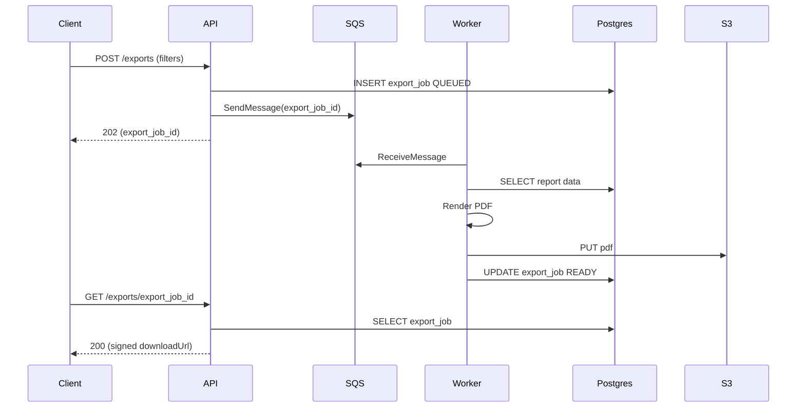

# ChronoLedger — API Design (v1)

_Last updated: 2026-01-02_

This document expands ADR-0015 with an endpoint outline and payload conventions. It is an implementation guide, not a contract for future versions.

## 1) Conventions

### Base URLs
- Public: `/api/v1`
- Admin: `/api/v1/admin`

### Headers
- `Authorization: Bearer <access_token>`
- `X-Device-Id: <uuid>` (**required** for per-device preferences)
- `Idempotency-Key: <uuid>` (recommended on POSTs that are retryable)
- `Content-Type: application/json`

### Time formats
- UTC timestamps: ISO 8601 (e.g., `2026-01-02T18:30:00Z`)
- IANA TZ: `America/Phoenix`, `Europe/London`, etc.

### Rounding
- Rounding is computed only (nearest 15 minutes) and never stored.

### Error format (RFC 7807)
```json
{
  "type": "https://chronoledger/errors/validation",
  "title": "Validation error",
  "status": 400,
  "detail": "One or more fields are invalid.",
  "instance": "/api/v1/time-entries",
  "errors": {
    "endLocal": ["End time cannot overlap an existing entry."]
  }
}
```

## 2) Core Endpoints

### 2.1 Identity / Session helpers
- `GET /api/v1/me`
  - Returns current user profile + role(s)
- `GET /api/v1/settings`
  - Returns per-user-per-device settings (uses X-Device-Id)
- `PUT /api/v1/settings`
  - Updates per-user-per-device settings (timezone override, time format, etc.)

**Settings payload**
```json
{
  "displayTimeZone": "America/Phoenix",
  "timeFormat": "12h"
}
```

### 2.2 Time entries

#### Create (open)
- `POST /api/v1/time-entries` (Idempotency-Key supported)

**Request**
```json
{
  "dateLocal": "2026-01-02",
  "startLocal": "08:00",
  "endLocal": null,
  "timeZone": "America/Phoenix",
  "timeCodeId": "ATO"
}
```

**Response (simplified)**
```json
{
  "id": "te_123",
  "status": "OPEN",
  "startUtc": "2026-01-02T15:00:00Z",
  "endUtc": null,
  "captureTimeZone": "America/Phoenix",
  "timeCodeId": "ATO",
  "isLocked": false
}
```

#### Complete (set end time)
- `PATCH /api/v1/time-entries/{id}`

**Request**
```json
{
  "endLocal": "12:00",
  "timeZone": "America/Phoenix"
}
```

Server responsibilities:
- auto-split cross-midnight if applicable
- block overlaps (after split)
- compute and persist raw duration
- lock on completion

#### Read/list
- `GET /api/v1/time-entries/{id}`
- `GET /api/v1/time-entries?from=2026-01-01&to=2026-01-15&status=LOCKED&timeCodeId=ATO&limit=50&cursor=...`

#### Delete
- `DELETE /api/v1/time-entries/{id}`
  - Only when unlocked; otherwise returns 409 Conflict

### 2.3 Unlock workflow

#### Request unlock
- `POST /api/v1/time-entries/{id}/unlock-requests` (Idempotency-Key supported)

**Request**
```json
{
  "reason": "Correct start time; entered 7:30 instead of 7:00"
}
```

**Response**
```json
{
  "id": "ur_456",
  "status": "PENDING",
  "timeEntryId": "te_123",
  "requestedAt": "2026-01-02T20:00:00Z"
}
```

#### Admin queue + decision
- `GET /api/v1/admin/unlock-requests?status=PENDING&limit=50&cursor=...`
- `POST /api/v1/admin/unlock-requests/{id}/approve`
- `POST /api/v1/admin/unlock-requests/{id}/deny`

Admin decision payload (optional)
```json
{
  "note": "Approved. Please correct and save; entry will re-lock."
}
```

### 2.4 Reports and exports

#### Report data (for UI views)
- `GET /api/v1/reports/pay-period?year=2026&month=1&payPeriod=PP1`
- `GET /api/v1/reports/weekly?from=2026-01-01&to=2026-01-31`
- `GET /api/v1/reports/ato?year=2026`

These endpoints return JSON for UI rendering and include:
- raw totals
- computed rounded totals
- warnings (e.g., >44 hours)

#### Export (PDF)
- `POST /api/v1/exports` (Idempotency-Key supported)

**Request**
```json
{
  "type": "PAY_PERIOD_SUMMARY",
  "filters": {
    "year": 2026,
    "month": 1,
    "payPeriod": "PP1"
  },
  "displayTimeZone": "America/Phoenix"
}
```

**Response**
```json
{
  "id": "ex_789",
  "status": "QUEUED"
}
```

- `GET /api/v1/exports/{id}`
  - returns status; if ready includes `downloadUrl` (signed URL)

### 2.5 Admin configuration

- `GET/POST/PUT /api/v1/admin/time-codes`
- `GET/POST/PUT /api/v1/admin/pay-rates` (effective date always 1st of month)
- `GET/POST/PUT /api/v1/admin/holidays`
- `GET/POST/PUT /api/v1/admin/users`
- `GET /api/v1/admin/audit/time-entries`
- `GET /api/v1/admin/audit/unlock-requests`
- `GET /api/v1/admin/audit/admin-actions`

## 3) Sequence diagrams

### PDF export


## 4) Resolved implementation selections

- Separate hostnames are accepted:
  - Web: `app.<domain>`
  - API: `api.<domain>`
- Time entry deletes are **soft deletes** (default behavior). Hard purge, if ever supported, is admin-only.
- `X-Device-Id` is required on authenticated requests to support **per-user-per-device** settings (timezone override). The server treats it as client-provided telemetry/preferences (not an authorization factor).

## 4) Resolved implementation selections

- Separate hostnames are accepted:
  - Web: `app.<domain>`
  - API: `api.<domain>`
- Time entry deletes are **soft deletes** (default behavior). Hard purge, if ever supported, is admin-only.
- `X-Device-Id` is required on authenticated requests to support **per-user-per-device** settings (timezone override). The server treats it as client-provided telemetry/preferences (not an authorization factor).

