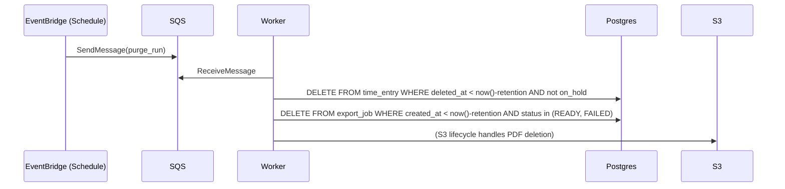

# ChronoLedger — Data Retention & Purging (Implementation Notes)

_Last updated: 2026-01-02_

This document expands ADR-0019 with concrete implementation guidance.

## 1) Tables and columns

- Soft delete fields:
  - `time_entry.deleted_at`
  - optional: `time_entry.deleted_by_user_id`, `time_entry.delete_reason`
- Export metadata:
  - `export_job.s3_key`
  - `export_job.template_version`
  - `export_job.pdf_checksum`

## 2) Scheduled jobs

Use a worker job triggered on a schedule (EventBridge → SQS message) to run purge tasks.

## 3) S3 lifecycle (PDF exports)

Recommended:

- Transition to cheaper storage after 30–90 days (optional).
- Delete after 2 years (default).

## 4) Tenant configurability (future)

If/when needed, move retention periods into `tenant_setting`:

- `retention.time_entries_days`
- `retention.audit_days`
- `retention.exports_days`
- `retention.logs_days`
