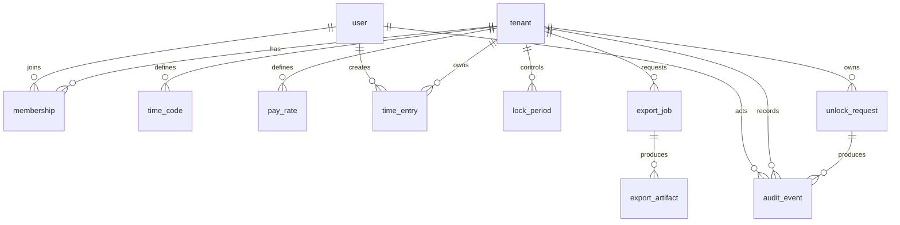

# Schema Blueprint

**Purpose:** Define the authoritative database blueprint for ChronoLedger: entities, relationships, invariants,
constraints, and indexes.

**Status:** Draft
**Last reviewed:** YYYY-MM-DD
**Related ADRs:**

- ADR-0002-postgresql-3nf.md
- ADR-0017-multitenancy-row-level.md
- ADR-0024-prisma-migrations.md
- ADR-0028-domain-invariants-state-machines.md
- ADR-0031-concurrency-idempotency.md

## Scope

This document specifies:

- Core entities and relationships
- Tenant boundaries and multi-tenant isolation strategy
- Invariants enforced at the database level
- Constraints and indexes required for correctness and performance
- Migration approach (including where raw SQL is required)

This document does **not** specify:

- UI-specific derived fields
- Non-authoritative caches/materialized views (unless explicitly added)

## Assumptions and definitions

- **Tenant:** The organizational boundary for data isolation.
- **User:** A person with one or more memberships in tenants.
- **Pay period:** PP1 = 1–15; PP2 = 16–end of month.
- **Official export:** A versioned, reproducible output intended for records.
- **Audit event:** An immutable record of an action affecting protected data or privileged workflows.

## Entity list (overview)

| Entity | Description | Notes |
| --- | --- | --- |
| tenant | Organization / boundary for isolation | row-level isolation strategy |
| user | Global user identity | typically mapped from Auth0 subject |
| membership | user ↔ tenant association | role(s), status, lifecycle |
| time_code | billable/category codes | tenant-scoped |
| pay_rate | effective-dated rates | tenant-scoped; supports history |
| time_entry | time intervals per user | overlap rules and “open entry” policy |
| lock_period | record of locked pay periods | tenant + user scope as needed |
| unlock_request | request/approval workflow | admin actions are audited |
| export_job | async export generation | status, retries, idempotency keys |
| export_artifact | stored export files | storage key, checksum, template version |
| audit_event | immutable audit log | append-only |
| idempotency_key | request dedupe | scope + TTL rules |

## ER diagram (high-level)

## Table specifications

### `tenant`

**Purpose:** Tenant boundary and metadata.

Columns (suggested):

- `id` (uuid, pk)
- `name` (text, not null)
- `created_at` (timestamptz, not null, default now())
- `updated_at` (timestamptz, not null)

Constraints:

- Unique tenant name (optional; decide if global uniqueness is required)

Indexes:

- `tenant(name)` (optional)

---

### `user`

**Purpose:** Global user identity.

Columns (suggested):

- `id` (uuid, pk)
- `auth_subject` (text, unique, not null) — Auth0 `sub`
- `email` (text, nullable)
- `email_verified` (boolean, not null, default false)
- `display_name` (text, nullable)
- `created_at` (timestamptz, not null)
- `updated_at` (timestamptz, not null)

Constraints:

- `auth_subject` unique

Indexes:

- Unique index on `auth_subject`

---

### `membership`

**Purpose:** Associates a user with a tenant and grants roles.

Columns (suggested):

- `id` (uuid, pk)
- `tenant_id` (uuid, fk → tenant.id, not null)
- `user_id` (uuid, fk → user.id, not null)
- `role` (text/enum, not null) — e.g., `USER`, `ADMIN`
- `status` (text/enum, not null) — e.g., `ACTIVE`, `INVITED`, `DISABLED`
- `created_at` (timestamptz, not null)
- `updated_at` (timestamptz, not null)

Constraints:

- Unique (`tenant_id`, `user_id`) (or (`tenant_id`, `user_id`, `role`) if multi-role)

Indexes:

- `membership(tenant_id, user_id)`

---

### `time_entry`

**Purpose:** Primary time interval record.

Columns (suggested):

- `id` (uuid, pk)
- `tenant_id` (uuid, fk → tenant.id, not null)
- `user_id` (uuid, fk → user.id, not null)
- `time_code_id` (uuid, fk → time_code.id, not null)
- `start_at` (timestamptz, not null)
- `end_at` (timestamptz, nullable) — null indicates “open entry”
- `notes` (text, nullable)
- `source` (text/enum, not null) — `WEB`, `MOBILE`, `SYSTEM`
- `created_at` (timestamptz, not null)
- `updated_at` (timestamptz, not null)

Invariants (must hold):

- `end_at` is null OR `end_at > start_at`
- At most one open entry per (`tenant_id`, `user_id`) at a time
- No overlapping intervals per (`tenant_id`, `user_id`) (policy defines boundary inclusivity)
- Entries cannot be created/edited within locked periods unless an approved unlock exists

Constraints:

- CHECK (`end_at is null OR end_at > start_at`)
- Partial unique index for “one open entry”
- Exclusion constraint (Postgres) to prevent overlap

Indexes:

- `time_entry(tenant_id, user_id, start_at desc)`
- `time_entry(tenant_id, user_id, end_at desc)` (optional)

Overlap prevention (raw SQL migration required):

- Use `tstzrange(start_at, end_at, '[)')` with exclusion constraint
- Define behavior for null end separately (open-entry uniqueness constraint)

---

## Cross-cutting constraints and indexes

### Multi-tenancy isolation

- All tenant-owned tables include `tenant_id`.
- Foreign keys should enforce tenant consistency (either via composite FKs or application-level checks).
- If using row-level security (RLS), define:
  - session parameter / role mapping
  - policies per table
  - test strategy to validate isolation

### Idempotency

- Define `idempotency_key` storage and scope (tenant + user + route) if required.
- Ensure uniqueness and TTL/cleanup policy.

### Auditability

- Identify which actions write to `audit_event`.
- Audit events must be append-only (no updates/deletes; consider partitioning later if needed).

## Migration strategy

- Prisma migrations are the default.
- Raw SQL migrations are permitted/expected for:
  - exclusion constraints
  - RLS policies
  - advanced partial indexes
  - triggers (if required)

Document raw SQL decisions in `chronoledger-db-migrations.md` and reference the ADR(s).

## Open questions

- Enumerations: which fields become enums vs free-form?
- Locking model: tenant-wide, user-specific, or both?
- RLS: enforce now (P0) vs later (P1)?
- Soft deletes: required? (If yes, audit + retention changes)
