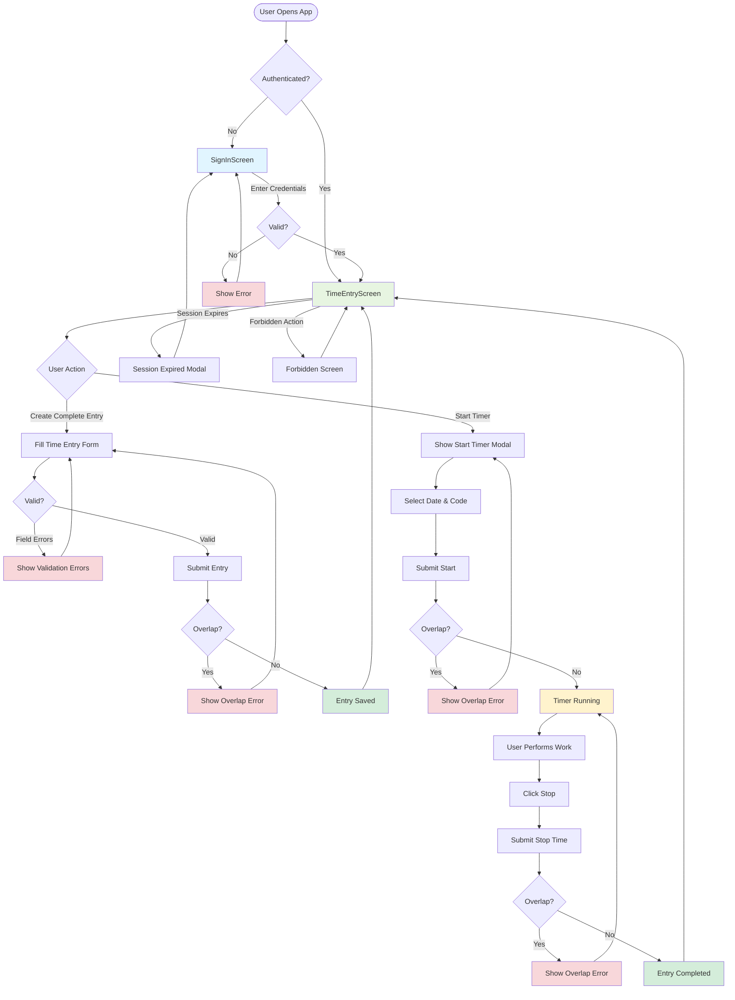

# UX Flow: SL-0001 — Auth + Time Entry MVP

## Overview

This document provides a visual flow for slice SL-0001, covering the complete user journey from sign-in through time entry creation and management.

## Related User Stories

- [US-0001: Sign in and establish session](../../10-governance/backlog/user-stories/US-0001-sign-in-session.md)
- [US-0003: Create time entry](../../10-governance/backlog/user-stories/US-0003-create-time-entry.md)
- [US-0004: Start/stop open entry](../../10-governance/backlog/user-stories/US-0004-open-entry-start-stop.md)

## High-Level User Journey

## Key Decision Points

### Authentication (US-0001)

- **Entry Point**: Every user must authenticate before accessing any features
- **Session Management**: Session expiry redirects to sign-in, preserving intended destination
- **Authorization**: Forbidden actions show clear error with return path

### Time Entry Creation (US-0003)

- **Validation Layers**:
  1. Client-side: Real-time field validation (end > start, required fields)
  2. Pre-submit: Complete form validation before API call
  3. Server-side: Overlap detection (DB-enforced), authorization, pay period rules
- **Error Recovery**: All errors allow user to correct and retry from the same form state

### Open Entry Timer (US-0004)

- **Start Constraints**: Only one open entry at a time, must select code before starting
- **Running State**: Timer updates every second (visual only, not announced to screen readers)
- **Stop Validation**: Can create overlap at stop time (detected and rejected)
- **Network Resilience**: Retry with idempotency for stop operations

## State Transitions

### Sign In → Time Entry Screen

1. User submits valid credentials
2. Session established with tenant context
3. Automatic navigation to TimeEntryScreen
4. Focus placed on primary action (form date field or start button)

### Timer Start → Running → Stop

1. Start button → Start modal appears
2. User selects date and code → Submit
3. Timer begins (visual indicator, no audio/continuous announcements)
4. User works (timer continues in background)
5. Stop button → Confirmation → Entry completed
6. Entry appears in list with final duration

### Error States → Recovery

- **Validation Errors**: Focus moves to first invalid field, user corrects in place
- **Overlap Errors**: Modal with conflict details, user can adjust times or cancel
- **Network Errors**: Automatic retry with visual indicator, manual cancel option

## Accessibility Highlights

- **Keyboard Navigation**: All actions accessible via Tab/Enter/Space
- **Focus Management**: Focus moves logically through workflows, returns to origin on errors
- **Screen Reader**: State changes announced (not continuous timer updates)
- **ARIA**: Proper roles (alertdialog, alert, timer) and live regions (polite)

## Edge Cases Handled

1. **Session expiry during timer**: Timer continues locally, stop operation triggers re-auth
2. **Multiple devices**: Sync indicator shows running timer from other device
3. **Network interruption**: Idempotent retry for critical operations (timer stop)
4. **Overlap conflicts**: Clear error messaging with conflicting entry details
5. **Pay period boundaries**: Validation prevents entries outside current pay period

## Implementation Notes

- Each state transition should have a clear loading indicator
- Error messages use consistent Problem+JSON format from API
- Success states should be brief (toast/banner) to avoid blocking workflow
- All modals/dialogs should be dismissible with Escape key (where safe)
- Timer state persists across page refreshes (stored in backend)
