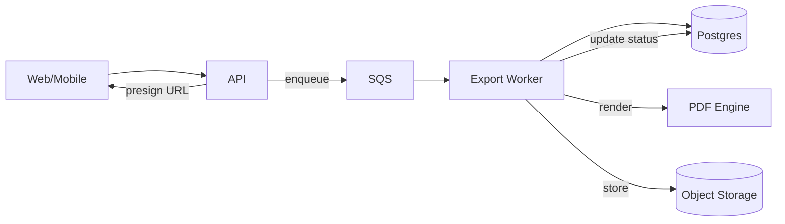

# Reports and Exports Catalog

**Purpose:** Define ChronoLedger’s reports and export outputs with precise, testable specifications—especially “official” PDFs.

**Status:** Draft
**Last reviewed:** YYYY-MM-DD

**Related ADRs:**
- ADR-0012-pdf-export-pipeline.md
- ADR-0018-pdf-rendering-html-chromium.md
- ADR-0019-data-retention-policy.md
- ADR-0030-api-error-contract-problem-json.md
- ADR-0033-testing-strategy.md

## Definitions

- **Report:** A view of data returned via API (JSON) or rendered in UI.
- **Export:** A generated artifact intended for download or record-keeping (PDF-first).
- **Official export:** A versioned, reproducible export suitable for records.
- **Template version:** Identifies the layout/content template.
- **Rendering version:** Identifies the PDF engine + font bundle + rendering settings.

## Export pipeline (high-level)

## Global export rules

### Versioning

Every export artifact MUST record:
- `export_id`
- `template_version`
- `rendering_version`
- `generated_at` (UTC timestamp)
- `input_parameters` snapshot (sanitized)
- `checksum` (e.g., SHA-256)

### Determinism

For “official” exports:
- Pin the PDF engine version.
- Pin and embed fonts.
- Normalize locale (dates, decimals).
- Normalize timezone handling per ADR-0004.
- Avoid environment-dependent formatting.

### Error model

Export endpoints return Problem Details (`application/problem+json`) with stable `code`.

## Catalog

> Add one section per export type. Keep specs exact and testable.

---

## Export: Pay Period Summary (Official PDF)

- **Export ID:** `pay-period-summary`
- **Audience:** User
- **Official:** Yes
- **Formats:** PDF

### Inputs

| Parameter | Type | Required | Notes |
|---|---:|:---:|---|
| tenantId | UUID | Yes | Tenant boundary |
| userId | UUID | No | Defaults to current user unless admin export is allowed |
| year | int | Yes | e.g., 2026 |
| month | int (1–12) | Yes | |
| payPeriod | enum | Yes | `PP1` or `PP2` |
| timezone | IANA tz | No | Defaults per user/tenant settings; must follow ADR-0004 |

### Output: Header fields

| Field | Source | Notes |
|---|---|---|
| Tenant name | tenant.name | |
| User display name | user.display_name | fall back to email |
| User email | user.email | optional |
| Pay period label | derived | e.g., `2026-01 PP1 (Jan 1–15)` |
| Generated at | system | include timezone label |
| Template version | system | required |
| Rendering version | system | required |

### Output: Line items

Sorted by **date ascending**, then **start time ascending**.

| Column | Definition | Notes |
|---|---|---|
| Date | local date | derived from `start_at` in display timezone |
| Time code | code/name | per `time_code` |
| Start | local time | |
| End | local time | if open intervals exist, define representation (recommended: disallow for official) |
| Duration | hh:mm | per rounding rules (must be specified) |
| Notes | text | optional |

### Output: Totals

| Metric | Definition |
|---|---|
| Total hours | sum of durations |
| Totals by time code | grouped sum |

### Validation

- Pay period must be valid for the given `year` + `month`.
- Entries must not overlap (DB invariant).
- For **official** export: time entries with `end_at = null` MUST be handled by policy:
  - Recommended: **reject** export with a 409 and `code=EXPORT_HAS_OPEN_ENTRY`.

### Problem codes (examples)

| HTTP | code | When |
|---:|---|---|
| 400 | INVALID_PAY_PERIOD | year/month/PP invalid |
| 403 | FORBIDDEN | tenant/membership does not allow export |
| 404 | NOT_FOUND | tenant/user not found or inaccessible |
| 409 | EXPORT_HAS_OPEN_ENTRY | open entry exists (official policy) |
| 409 | PERIOD_LOCK_CONFLICT | export prohibited due to lock/unlock rules (if applicable) |

### Golden fixtures

- `pp-summary-basic` — standard PP1 with multiple days and codes
- `pp-summary-weekend-holiday` — ensures weekend/holiday formatting rules (if any)
- `pp-summary-rounding-edge` — verifies rounding rules (e.g., 7:59 → 8:00)

---

## Export: Time Entry Detail (Non-official)

- **Export ID:** `time-entry-detail`
- **Audience:** User/Admin
- **Official:** No
- **Formats:** PDF, CSV (optional)

### Notes

Use the same structure as the official export, but allow inclusion of open intervals if policy supports it.

---

## Open items to finalize

- Rounding rules and display format (hh:mm vs decimal hours)
- Open-entry policy for exports (official vs non-official)
- Lock/unlock interaction with exports (allowed, restricted, or requires approval)
- Template and rendering versioning scheme (semver vs monotonic)

