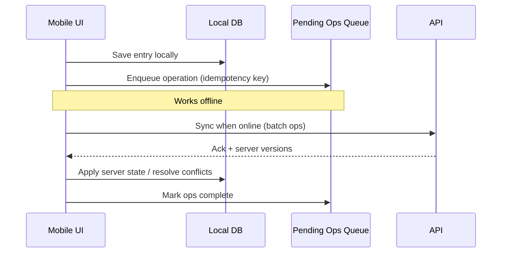

# ChronoLedger — Candidate Patterns & ADR Triggers

_Last updated: 2026-01-04_

## Purpose
This doc is a **shortlist of design patterns** that are likely to matter for ChronoLedger (mobile + web, Node/Nest API, Postgres/Prisma, PDF-first reporting, auditability, and cross-device sync). It’s not a commitment to use all of these—think of it as a **menu + decision checklist**.

**How to use this:**
- Start with the **System-level patterns** (these are the ones that can cause rework if picked late).
- Treat everything else as **candidate implementation patterns** that can be adopted incrementally.
- When a “Trigger” becomes true, capture the decision as an **ADR**.

## What belongs in planning vs implementation
- **Planning / ADR-worthy**: patterns that affect *boundaries, data flow, sync, reporting architecture, security posture, deployment, observability*.
- **Implementation-time**: patterns that mostly improve local code structure (Strategy/Factory/etc.) and can be introduced safely later.

---

## 1) System-level patterns (most ADR-worthy)

| Pattern | Where it applies | Why it matters for ChronoLedger | ADR trigger (decision point) | Priority |
|---|---|---|---|---|
| **Vertical Slice / Feature Modules** | Repo structure; API modules; UI modules | Matches the “build in vertical slices” plan; minimizes cross-cutting rework | “Are we organizing by layer (controllers/services/repos) or by feature (time-entry, reports, admin)?” | P0 |
| **Clean Architecture / Hexagonal (Ports & Adapters)** | API (and optionally mobile) | Keeps domain rules (time validation, locks, ATO ledger) independent from Nest/Prisma; makes testing simpler | “Do we expect swapping storage/export engines, or heavy rule evolution?” | P0 |
| **Optimistic Concurrency Control (OCC)** | Sync + API writes | Prevents silent overwrites; supports deterministic conflict handling | “Do we allow edits from multiple devices? How do we detect/resolve concurrent edits?” | P0 |
| **Idempotency Keys for Writes** | API endpoints (create/update time entries, unlock requests, exports) | Mobile sync + flaky networks will cause retries; idempotency prevents duplicate writes | “Will clients retry writes automatically? Do we do background sync?” | P0 |
| **Light CQRS for Reporting** | Reports + exports (queries) | Reporting often needs different shapes/indexes than transactional writes; helps performance and clarity | “Are reports slow/complex enough to justify read-optimized queries/views?” | P1 (maps to Reporting/Query ADR) |
| **Outbox Pattern (reliable async jobs)** | Export pipeline; notifications; audit-side effects | Makes export generation and side-effects reliable even if worker/queue is down | “Are exports generated asynchronously? Do we need guaranteed delivery?” | P0/P1 |
| **Immutable Ledger for ATO** | ATO accrual + usage | Ledger model makes audits easy: you never ‘edit balances,’ you add events and compute balance | “Do we need a provable, traceable ATO history (who/what/when/why)?” | P0 |
| **Policy-based Authorization (RBAC now, ABAC later)** | API guards; admin routes | Keeps permissions explicit and testable; avoids scattered `if (isAdmin)` checks | “Are roles static or do we need fine-grained permissions later?” | P0 |

### Mermaid: high-level boundary sketch
```mermaid
flowchart LR
  subgraph Clients
    M[Mobile (React Native)]
    W[Web]
  end

  subgraph API
    C[Controllers]
    A[Auth Guards/Policies]
    U[Use Cases / Services]
    D[Domain (Rules + Value Objects)]
    R[Repositories (Ports)]
  end

  subgraph Adapters
    P[(Postgres via Prisma)]
    X[Export Worker]
    O[(Object Storage)]
  end

  M --> C
  W --> C
  C --> A --> U --> D --> R --> P
  U --> X --> O
```

---

## 2) Backend/API patterns (high leverage, usually easy to add)

| Pattern | Where it applies | Why it matters | ADR trigger (decision point) | Priority |
|---|---|---|---|---|
| **Repository Pattern** | API data access | Prevents Prisma from leaking everywhere; improves testability | “Do we want domain/use cases independent of Prisma queries?” | P0 |
| **Unit of Work (transaction boundary)** | Multi-step writes (lock/unlock, approvals, ATO events) | Ensures consistency when multiple tables change together | “Do we have multi-entity operations that must be atomic?” | P0 |
| **Specification Pattern (rule composition)** | Time-entry validation (overlaps, weekly limits, lock rules) | Keeps complex rules readable and reusable | “Are rules growing and becoming hard to reason about?” | P0 |
| **Strategy Pattern (rule variants)** | Rules by code type, user role, future policy changes | Lets you swap rule sets without giant switch statements | “Do different categories (contract vs additional vs ATO) diverge in behavior?” | P0 |
| **Command Pattern (audited actions)** | “Create entry”, “Unlock request”, “Approve unlock”, “Generate export” | Makes business actions explicit; pairs naturally with audit logging | “Do we want consistent auditing + testable business actions?” | P0 |
| **Domain Value Objects** | `TimeInterval`, `PayPeriod`, `Hours`, `Rate`, `Money` | Eliminates unit bugs and edge-case chaos (time math is a swamp) | “Are we seeing repeated date/time math and validation everywhere?” | P0 |
| **Interceptor/Decorator for Audit + Logging** | API middleware/interceptors | Guarantees audit entries and correlation IDs consistently | “Are we missing audits because devs forget?” | P0 |

---

## 3) Mobile/client patterns (especially important if offline is real)

| Pattern | Where it applies | Why it matters | ADR trigger (decision point) | Priority |
|---|---|---|---|---|
| **Offline Queue (Pending Ops)** | Mobile local DB | Enables offline entry and reliable sync; operations replay safely | “Are we committing to offline support (recommended in PRD)?” | P1 (maps to Offline/Sync ADR) |
| **Sync Engine with Deterministic Conflict Rules** | Mobile + API | Conflicts are inevitable with multi-device edits; deterministic outcomes avoid support nightmares | “What wins on conflict (server, client, timestamps, versions)?” | P1 |
| **State Machine for Time Entry Mode** | Timer/open-interval handling | Prevents invalid UI states (multiple open intervals, half-saved edits) | “Do we support open intervals + editing while running?” | P0 |
| **Adapter Pattern for Storage** | Local persistence (SQLite vs something else) | Keeps storage implementation swappable and testable | “Do we expect swapping local DB or sharing code with web?” | P1 |

### Mermaid: offline sync (typical)


---

## 4) Reporting + export patterns (PDF-first “official outputs”)

| Pattern | Where it applies | Why it matters | ADR trigger (decision point) | Priority |
|---|---|---|---|---|
| **Export Pipeline (staged processing)** | Worker/service | Clean separation: fetch → transform → render → store → version | “Are exports async? Do we store versions and re-render deterministically?” | P0/P1 |
| **Template Method for Report Generation** | Each report type | Standardizes steps; report-specific overrides are small | “Are we adding multiple report types soon?” | P0 |
| **Factory for Report Builders** | Export worker | Selects correct report generator from catalog | “Do we need a single entry point for exports?” | P0 |
| **Adapter around Rendering Engine** | Playwright/Chromium/PDF lib | Keeps renderer swappable; isolates quirks | “Are we unsure which rendering approach we’ll standardize on?” | P0 |
| **Golden Master Testing (fixtures)** | CI tests for PDFs | Ensures deterministic “official” outputs; catches regressions immediately | “Are outputs legally/financially sensitive enough that layout regressions are unacceptable?” | P0 |
| **Strategy for Format Variants** | PDF now, CSV later | Prevents report logic from being tied to PDF | “Are we adding CSV or ‘draft vs official’ outputs later?” | P1 (maps to Export Formats ADR) |

### Mermaid: export pipeline (typical)


---

## 5) Auditability patterns (ChronoLedger’s “special sauce”)

| Pattern | Where it applies | Why it matters | ADR trigger (decision point) | Priority |
|---|---|---|---|---|
| **Append-only Audit Log** | DB tables | Makes “who/what/when/why” provable; avoids tampering concerns | “Do we allow edits/deletes of audit records? (Usually: no.)” | P0 |
| **Audit as Cross-Cutting Concern (Interceptor)** | API | Prevents missing audits; consistent event schema | “Do we want audits guaranteed for specific actions?” | P0 |
| **Event-like Ledger Entries** | ATO accrual/usage; lock/unlock history | Supports traceability and reproducible recomputation | “Do balances need to be recomputable from history?” | P0 |

---

## 6) “Nice to have later” patterns (only if complexity demands it)

These are powerful, but they cost complexity. Consider them only if you hit real pain:

- **Full Event Sourcing** (beyond the ATO ledger) — only if auditability + history replay becomes central to *everything*.
- **Saga / Process Manager** — only if workflows span multiple services or long-lived multi-step processes.
- **CQRS + Read Models everywhere** — only if reporting/performance demands it broadly.
- **CRDTs for sync** — only if you need collaborative editing / extremely complex merges.

---

## 7) Suggested ADR mapping (so we capture decisions at the right time)

These align with the areas already identified as ADR-worthy topics:

- **Offline + sync policy (P1):** Offline Queue, deterministic conflict rules, OCC, idempotency strategy.
- **Reporting/query strategy (P1):** Light CQRS, read-optimized queries/views, export pipeline boundaries.
- **Export formats beyond PDF (P1):** Strategy for formats, “official vs draft” definition, retention implications.
- **Advanced tracing (P2):** Interceptors/decorators, correlation IDs, OpenTelemetry sampling.

---

## 8) Next steps
1. Add this doc under `docs/` (wherever you keep design notes), and treat it as a living “pattern radar.”
2. For each P0/P1 trigger above, decide whether it becomes an ADR now or stays as an implementation note.

**Reminder:** update any applicable README index files (e.g., `docs/README.md` and/or ADR index) with a link to this doc so it doesn’t get lost.

