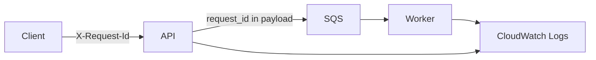

# ChronoLedger — Observability (Implementation Notes)

_Last updated: 2026-01-02_

## 1) Log schema (recommended fields)

```json
{
  "timestamp": "2026-01-02T18:30:00Z",
  "level": "INFO",
  "service": "api",
  "env": "dev",
  "request_id": "req_...",
  "tenant_id": "ten_...",
  "user_id": "usr_...",
  "device_id": "dev_...",
  "route": "POST /api/v1/exports",
  "status_code": 202,
  "duration_ms": 43
}
```

## 2) Correlation flow



## 3) Alarm starter set

- API:
  - 5xx > 1% over 5 minutes
  - p95 latency threshold (tune after baseline data)
- Worker:
  - failure count > N in 10 minutes
- SQS:
  - oldest message age > 5 minutes (tune)
- RDS:
  - free storage < threshold
  - CPU > threshold sustained

## 4) PII/sensitive logging rules

- Never log raw tokens, passwords, or full request bodies.
- For time entries, log IDs and summary fields only.
- Escape/sanitize user-provided strings in audit logs and templates.
