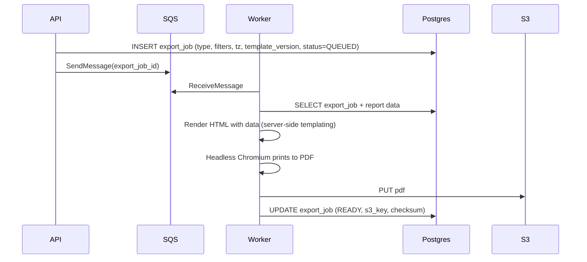

# ChronoLedger — PDF Rendering Approach

_Last updated: 2026-01-02_

This document expands ADR-0018 with implementation guidance for “official” PDFs.

## 1) Template strategy

- Templates live in the worker image under `templates/`.
- Each export type has a template directory:
  - `templates/pay_period_summary/v1/`
  - `templates/weekly_summary/v1/`
- Templates are versioned (`v1`, `v2`, ...). Export jobs record the template version used.

## 2) Rendering workflow

## 3) Determinism and “official” output

- Embed fonts (avoid relying on system fonts).
- Pin Chromium version via the worker image.
- Store a checksum of the PDF in `export_job` for integrity checks.
- Include “Generated at” timestamp and display time zone in the PDF footer.

## 4) Security and safety

- Do not render untrusted HTML.
- Only render known templates with data bound server-side.
- Validate and sanitize any user-provided strings used in templates (escape by default).

## 5) Testing approach

- Golden-file tests per template version (render and compare metadata/checksum with tolerance).
- Visual regression tests for key reports (optional but valuable).
- Pagination tests for large data sets.
