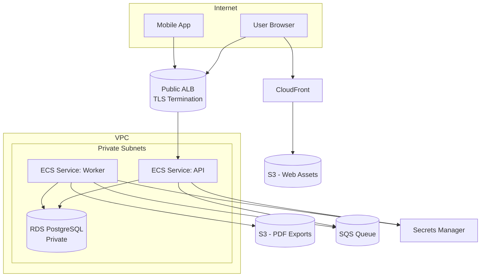
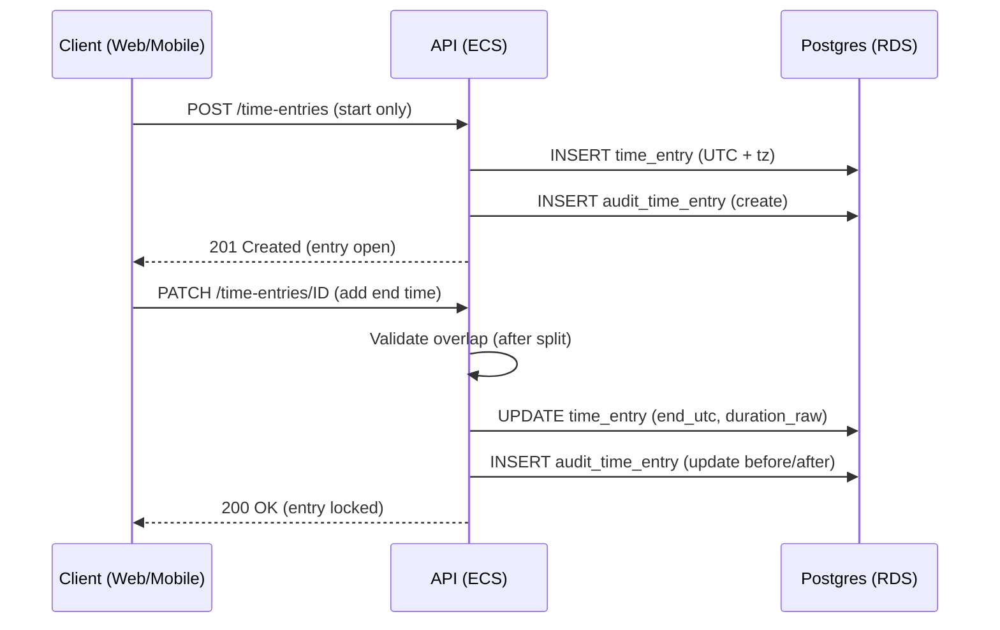
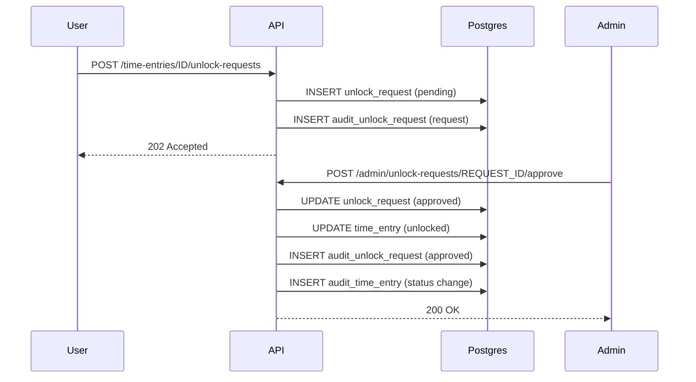
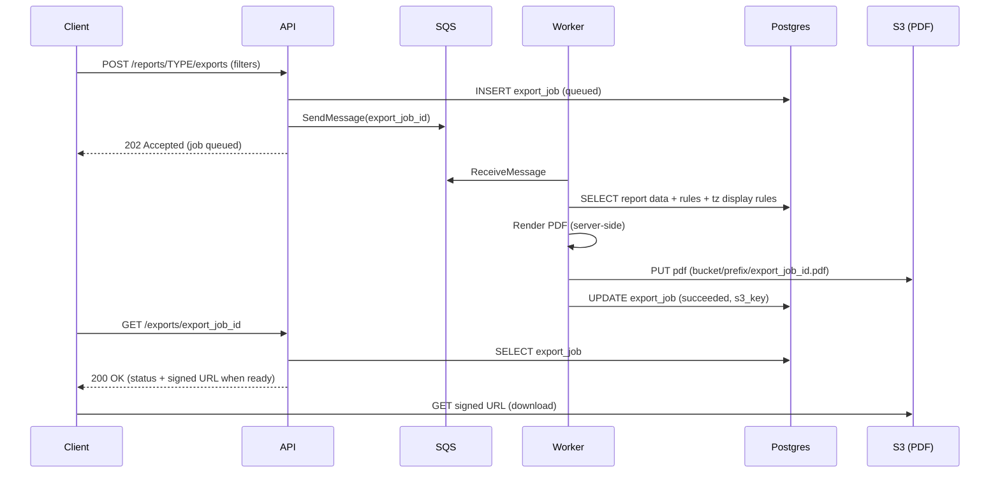

# ChronoLedger — Architecture Overview

_Last updated: 2026-01-02_

This document describes the target cloud-first architecture for ChronoLedger, aligned with accepted ADRs.

## 1. High-Level Components

- **Web Client**: SPA hosted on S3 + CloudFront
- **Mobile Client**: iOS + Android app
- **API Service**: ECS/Fargate service behind a public ALB
- **Worker Service**: ECS/Fargate service processing background jobs
- **Queue**: SQS for background jobs (PDF, scheduled work)
- **Database**: RDS PostgreSQL (3NF core schema + domain audit tables)
- **Object Storage**: S3 for PDF exports (and optionally other artifacts)
- **Secrets**: AWS Secrets Manager
- **Observability**: CloudWatch logs/metrics (baseline)

## 2. Network Topology (Conceptual)

## 3. Primary Request Flows

### 3.1 Time Entry Create/Complete (simplified)

### 3.2 Unlock Request + Admin Approval

### 3.3 Official PDF Export

## 4. Data Model Notes (3NF + Audit)

- Core entities are normalized (3NF) for correctness.
- Reporting objects (views/materialized views) may be introduced later, but authoritative data remains normalized tables.
- Audit tables are domain-specific:
  - `audit_time_entry`
  - `audit_unlock_request`
  - `audit_admin_action`

## 5. Deployment Notes (baseline)

- Images built and pushed to **ECR**
- ECS services deploy new task revisions
- Web assets uploaded to S3 and CloudFront invalidated
- DB migrations run as a controlled step in the deploy pipeline

## 6. Future Growth Considerations

- Multi-tenant: introduce `tenant` + tenant-scoped configuration tables and enforce tenant boundaries in API.
- Scaling: add ECS autoscaling policies, RDS Multi-AZ, and read replicas if needed.
- Caching: introduce Redis (ElastiCache) only if proven necessary (reports, sessions, etc.).
